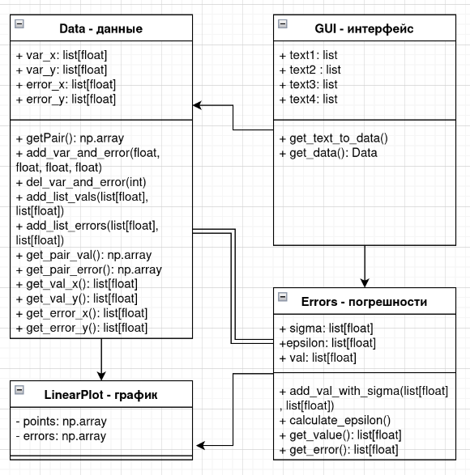
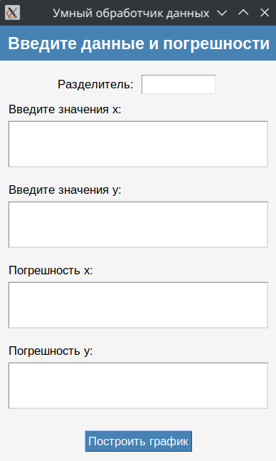

1. Обработчик данных для лабораторных работ.
2. Калинин Александр, Б05-402
3. Функции:
    - Настройка параметров ввода и вывода данных через графический интерфейс
    - Построение графиков в matplotlib
    - Возможность легко добавить новый шаблон графика в проект
    - Функция для подсчёта погрешностей измерений
4. Внутреннее устройство кода:

5. Программа выглядит примерно так:

